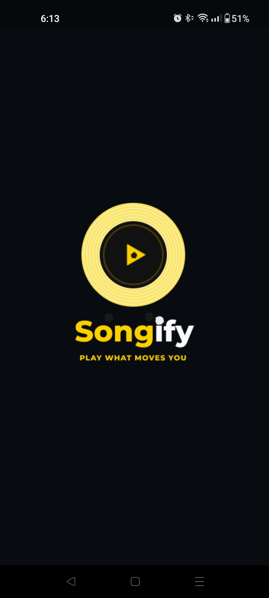
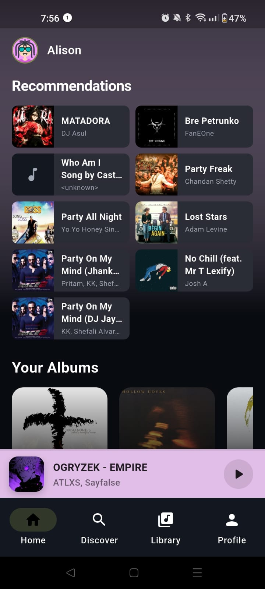
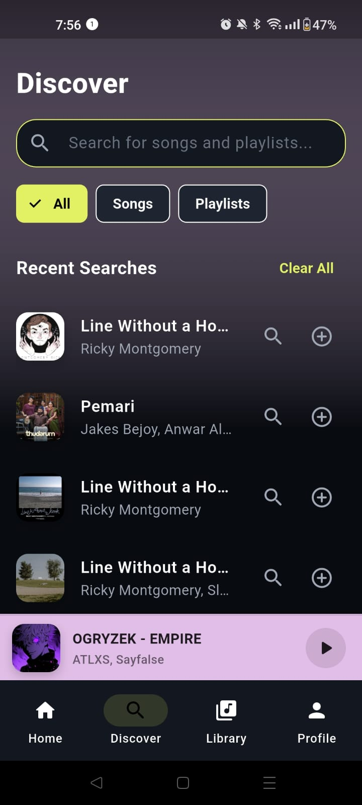
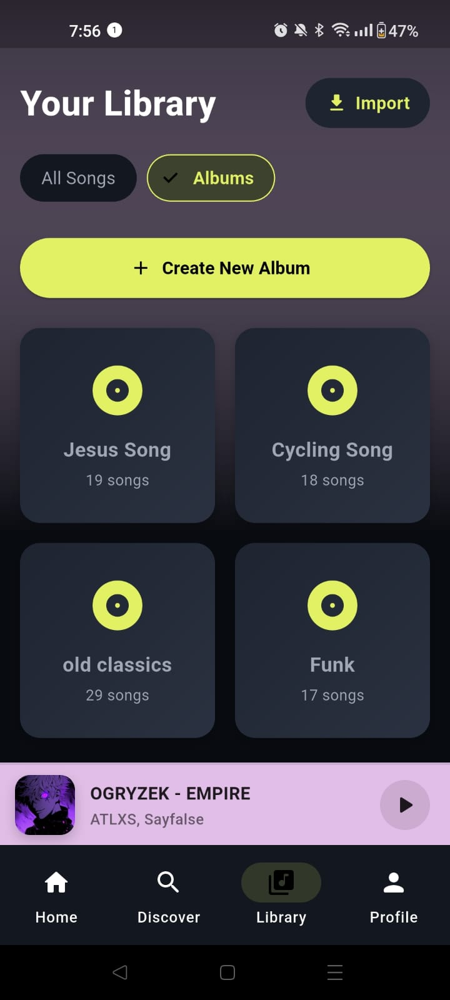
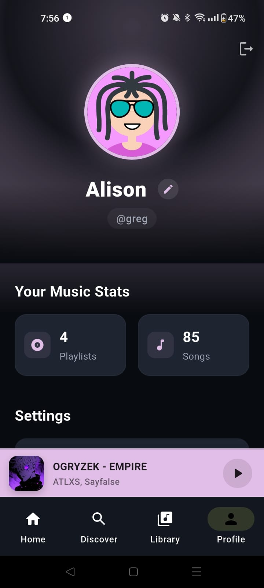

# Songify 🎵

<p align="center">


</p>

**An ad-free, personalized music streaming experience built with Flutter.**

🌐 **Live Website:** [songify-website.vercel.app](https://songify-website.vercel.app/)

> [!WARNING]
> **Disclaimer:** Songify is strictly an educational and portfolio project. It is not intended for commercial use, monetization, or public distribution.
>
> Music content, audio streams, metadata, and artist information are provided through unofficial endpoints and remain the intellectual property of JioSaavn and their respective copyright holders.

---

## About

Songify is a music streaming application built with **Flutter**, created to explore how a modern music player can be designed and developed without the interruptions of traditional ad-supported streaming.

The project focuses on a clean, simple, and personalized listening experience while providing hands-on experience with mobile development, APIs, UI/UX, and application architecture.

### Why I Built It

I started Songify because I wanted a music experience without constant interruptions from ads.

Instead of simply complaining about it, I decided to build my own solution and use the project as an opportunity to learn, experiment, and improve my development skills.

---

## ✨ Features

* 🎵 Ad-free music listening experience
* 🔎 Search for songs and artists
* 🎧 Music playback and controls
* ❤️ Personalized music experience
* 📱 Built with Flutter
* 🎨 Clean and simple user interface
* ⚡ Fast and responsive experience

> Features may change as the project continues to evolve.

---

## 📸 Screenshots

<div align="center">
  
  
  
  
  
</div>

---

## 🛠️ Tech Stack

* **Flutter** — Mobile application development
* **Dart** — Application logic
* **JioSaavn unofficial endpoints** — Music data and streaming
* **Vercel** — Project website

---

## 🚀 Getting Started

### Prerequisites

Before running Songify locally, make sure you have:

* [Flutter](https://flutter.dev/) installed
* [Dart](https://dart.dev/) installed
* Git installed
* An Android device or emulator

### Installation

Clone the repository:

```bash
git clone https://github.com/YOUR-USERNAME/YOUR-REPOSITORY.git
cd YOUR-REPOSITORY
```

Install dependencies:

```bash
flutter pub get
```

Run the application:

```bash
flutter run
```


---

## 🤝 Contributing

Contributions are welcome!

Whether you're fixing a bug, improving the UI, adding a feature, or improving documentation, we'd love to have you contribute.

**New to open source?** Start small. You can begin with documentation, UI improvements, bug fixes, or other beginner-friendly tasks.

For the complete contribution process, read **[`CONTRIBUTING.md`](CONTRIBUTING.md)**.

### 👥 Contributors

Songify is improved by people who contribute their time, ideas, and skills.

Meet the people who have contributed to Songify in **[`CONTRIBUTORS.md`](CONTRIBUTORS.md)**.

---

## 🎨 Credits

### Design & Logo

A huge thank you to **Abigale Shelke** for the amazing design and logo work.

---

## 📌 Project Status

Songify is an **independent learning and portfolio project** and is actively being improved.

The project may contain experimental features, unofficial integrations, and breaking changes as development continues.

---

## ⚠️ Disclaimer

Songify does not host or own the music content made available through the application.

All music, artwork, metadata, artist information, and related content belong to their respective copyright holders.

The application uses unofficial endpoints for educational purposes and is **not affiliated with, endorsed by, or sponsored by JioSaavn**.

Please respect the terms of service and copyright laws applicable in your region.

---

## 📄 License

This project is intended for **educational and portfolio purposes**.

See the repository's [`LICENSE`](LICENSE) file for the applicable terms.

---

---

Contact Dev. :- 
Owner - alisonpinto955@gmail.com
Co-creator - prafulmohite2006@gmail.com

---

<div align="center">

**Built with ❤️, Flutter, and a slightly unreasonable desire for better music apps.**

</div>
